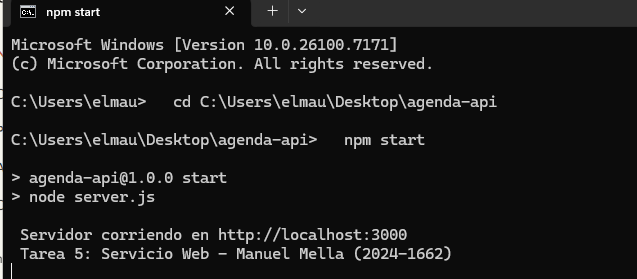
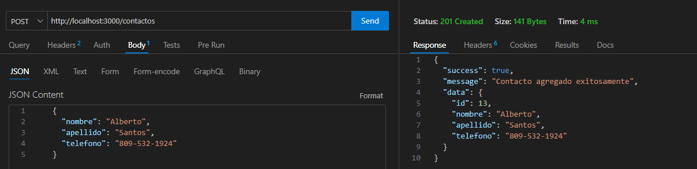
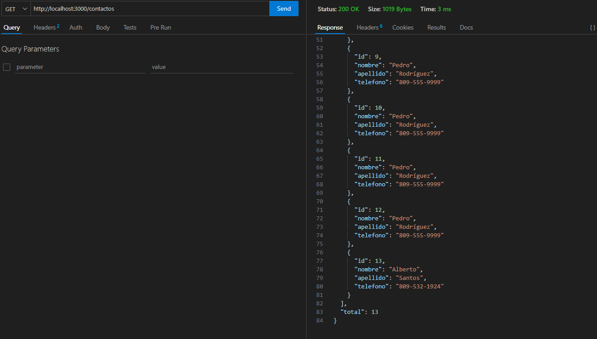

# API REST - Agenda de Contactos

**Autor:** Manuel Mella  
**Matrícula:** 2024-1662  
**Tarea:** #5 - Servicio Web con Express

## Descripción

API REST desarrollada con Node.js y Express que permite gestionar una agenda de contactos.

# Capturas de pantalla

