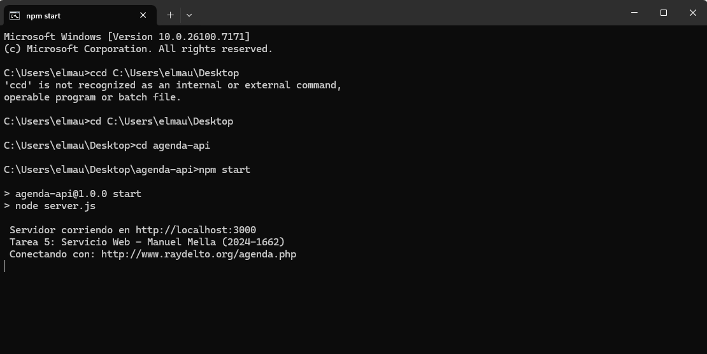
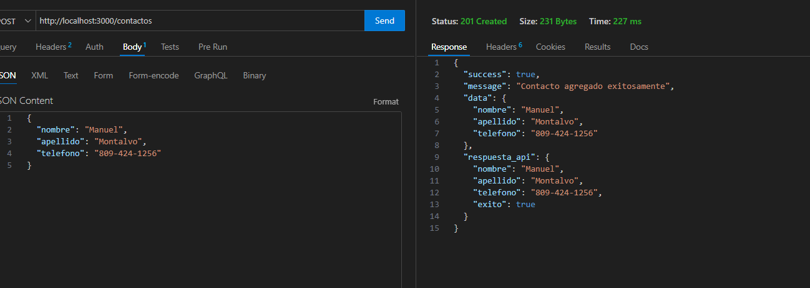
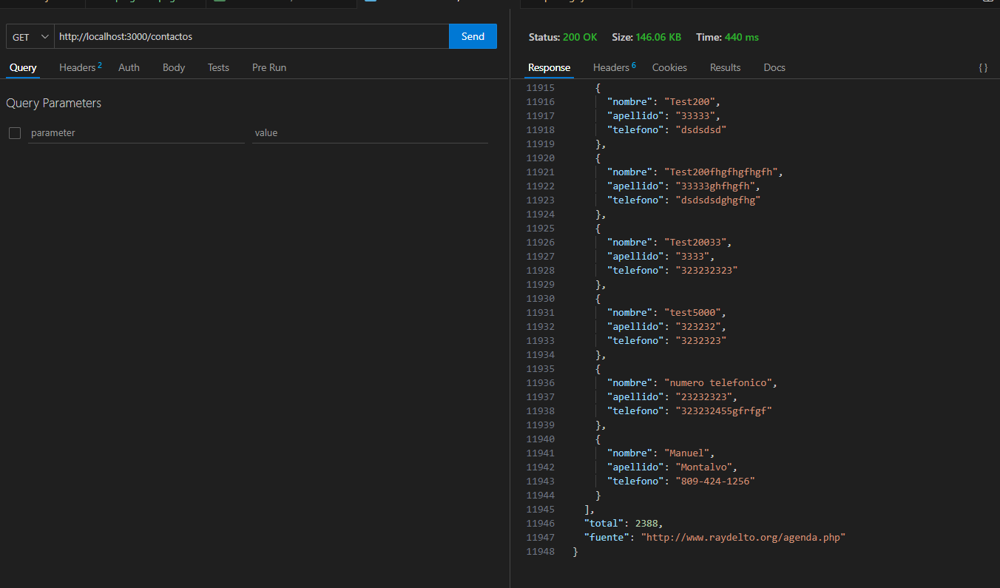

# API Intermediaria - Agenda de Contactos

**Autor:** Manuel Mella  
**Matrícula:** 2024-1662  
**Tarea:** #5 - Servicio Web con Express

## Descripción

Servicio Web desarrollado con Node.js y Express que actúa como intermediario para consumir la API de contactos.

El servidor recibe peticiones del cliente, las reenvía a la API de raydelto, y devuelve las respuestas con formato mejorado.

## Capturas de Pantalla

